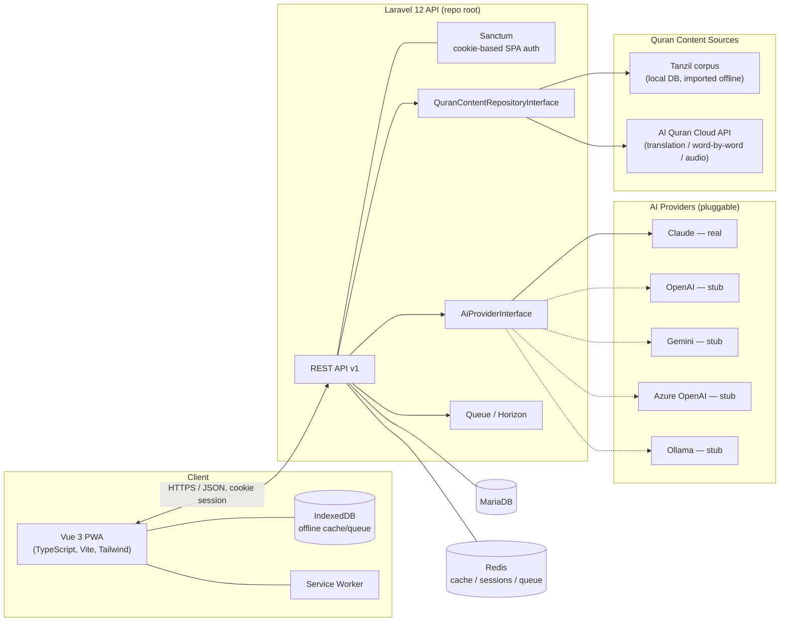

# Phase 2 — System Architecture

## 1. High-Level Architecture

## 2. Component Breakdown

- **Repo root** — Laravel 12 API-only application (`app/`, `routes/`,
  `database/`, etc. live directly at the root, not in a subdirectory — see
  §4). Owns all business logic, the AI/Quran abstraction layers, and
  persistence.
- **`frontend/`** — Vue 3 + TypeScript SPA/PWA. Talks to the backend only via
  the versioned REST API; never accesses the database or AI providers
  directly.
- **`docker/`** — nginx config for the dockerised backend.

## 3. Tech Stack & Rationale

| Layer | Choice | Why |
|---|---|---|
| Backend framework | Laravel 12 / PHP 8.4+ | Mature ecosystem (Sanctum, Horizon, queues, scheduler) for a content- and job-heavy domain |
| DB | MariaDB (SQLite for dependency-free local dev) | Relational integrity for the memorisation/review graph; wide hosting support |
| Cache/queue/sessions | Redis | Required by Horizon; also backs cookie-session storage and content caching |
| Frontend framework | Vue 3 + TypeScript + Vite | Fast dev loop, strong typing, first-class PWA plugin ecosystem |
| Styling | Tailwind CSS v4 | Utility-first, easy dark/light and accessibility theming |
| Offline storage | IndexedDB (`idb`) | Structured offline queueing beyond what a Cache Storage-only SW can do |
| PWA tooling | `vite-plugin-pwa` (Workbox) | Standard, well-supported service worker + manifest generation |

## 4. Repository Layout Decision

**Laravel lives at the repo root** (`app/`, `routes/`, `database/`,
`composer.json`, `artisan`, etc. directly at the top level); `frontend/` is
the one subdirectory, and its production build outputs straight into
`public/` (`frontend/vite.config.ts`, `outDir: '../public'`).

This wasn't the original design — the first cut put Laravel in its own
`backend/` subdirectory, mirroring `frontend/`, for a clean visual split.
That broke in production: Laravel Forge's Zero-Downtime Deployment (and
most deploy tooling generally) assumes `composer.json` and the app live at
the repository root, and generates its Nginx/PHP-FPM config, Composer/NPM
install steps, and `.env`/`storage` symlinking against that assumption. A
non-default "Web Directory" path was enough to break Forge's release-path
templating in three different places (Composer install, its Commands
feature, and the generated Nginx config itself all pointed at a phantom
release path instead of the real active release) — a live, reproducible bug
independent of anything in this app's own code. Moving Laravel to the root
removed the mismatch entirely: no custom Web Directory, no custom
scheduler/queue command paths, no per-deploy `.env` symlink workaround.

**Trade-off accepted**: this makes the repo asymmetric (Laravel implicit at
the root, frontend explicit in its own directory) rather than two visually
parallel siblings. That's a cosmetic cost; matching what deploy tooling
expects by default is worth more in practice than the symmetry.

Local dev keeps the same decoupled-origins topology regardless (Vite dev
server on `:5173` proxying to the Laravel dev server on `:8000`, §9) — this
section is about where the *files* live, not how they're served locally.
Production, by contrast, serves both from one Forge site/one origin (§10),
which also sidesteps CORS/cross-domain Sanctum concerns entirely there.

## 5. AI Provider Abstraction

`App\Contracts\AI\AiProviderInterface` defines `evaluateRecitation()`,
`generateFeedback()`, `getProviderName()`, `isAvailable()`.
`App\Services\AI\AiProviderManager` (Laravel's driver-manager pattern — the
same one powering cache/queue/mail) resolves the configured driver from
`config('ai.default')` / `AI_PROVIDER` env var. Adding a new provider means
adding one `create*Driver()` method and a config block — zero changes to
consuming code.

`evaluateRecitation()` is invoked end-to-end from the PWA: the browser's Web
Speech API transcribes a spoken recitation to text client-side, the text is
posted to `POST /api/v1/surahs/{s}/ayat/{a}/evaluate-recitation`
(`App\Http\Controllers\Api\V1\AiEvaluationController`, throttled at
20/min since each call is a billed request), and the controller returns the
parsed `RecitationEvaluationResult` for the frontend to display before the
learner confirms the attempt. If the provider is unavailable or the call
fails, the endpoint returns `503` and the UI falls back to manual
self-assessment rather than blocking the learner.

Shipped in this scaffold:

| Provider | Status |
|---|---|
| Claude | Real — calls the Anthropic Messages API |
| OpenAI | Stub — interface satisfied, throws `AiProviderNotImplementedException` |
| Gemini | Stub |
| Azure OpenAI | Stub |
| Ollama | Stub — intended for offline/local-LLM dev use |

## 6. Quran Content Abstraction

`App\Contracts\Quran\QuranContentRepositoryInterface` isolates all Quran
content access (surah/ayah metadata, Arabic text, translation, word-by-word,
audio URL) behind a contract, so the underlying source can be replaced
without touching consuming code if licensing/attribution requirements
change.

Shipped implementation — `TanzilAlQuranCloudRepository`:

- **Arabic Uthmani text** + structural metadata (surah/juz/hizb-quarter/page/
  ruku/sajda) — read from the local `surahs`/`ayat` tables, seeded via
  `php artisan quran:import-tanzil`, which fetches the Uthmani edition Al
  Quran Cloud mirrors from Tanzil (`GET /v1/quran/quran-uthmani`, one bulk
  request for all 6,236 ayat) and upserts it. An offline path from a
  manually downloaded Tanzil corpus is a documented but unimplemented
  alternative (`TANZIL_CORPUS_PATH`).
- **Translation, audio** — real HTTP calls to the Al Quran Cloud API
  (`api.alquran.cloud`), cached in Redis (~7 days TTL).
- **Word-by-word** — Al Quran Cloud has no official word-by-word endpoint;
  this reads from the local `ayah_words` table instead, which this scaffold
  leaves unseeded. Populate it from a licensed word-by-word corpus before
  relying on it.

## 7. Auth Strategy

Cookie-based Sanctum SPA authentication (`SANCTUM_STATEFUL_DOMAINS`,
`SESSION_DOMAIN`, CORS `supports_credentials: true`) rather than bearer
tokens in `localStorage`. Chosen because frontend and backend are first-party
here, and cookie auth avoids XSS token-theft exposure that `localStorage`
tokens carry.

**Trade-off accepted**: this couples auth to the configured stateful
domain(s). A future separate-domain production split or a native mobile
client may be better served by Sanctum's bearer-token mode instead — that's
a config change (`config/sanctum.php`), not an architectural one.

Flow: client `GET /sanctum/csrf-cookie` → client reads `XSRF-TOKEN` cookie →
subsequent mutating requests send `X-XSRF-TOKEN` header → Laravel validates
CSRF + session cookie via `EnsureFrontendRequestsAreStateful` middleware
(`bootstrap/app.php`'s `$middleware->statefulApi()`).

## 8. Offline / PWA Architecture

- **Service worker** (Workbox, via `vite-plugin-pwa`) precaches the app
  shell so the PWA installs and boots offline.
- **IndexedDB** (`frontend/src/lib/db.ts`) holds structured offline state:
  cached ayat and a `pendingReviewLogs` queue for recitation attempts made
  offline. Both stores are scaffolded but unused until offline sync
  (a future phase) writes to them.
- **Sync/conflict resolution** for the pending-logs queue is explicitly not
  implemented in this scaffold.

## 9. Dev Environment (Docker Topology)

See `docker-compose.yml`. Services: `app` (PHP 8.4-FPM), `nginx` (serves
`public/`, port 8000), `mariadb`, `redis`, `horizon` (queue worker),
`frontend` (Vite dev server, port 5173). All on one bridge network; the
frontend's Vite dev proxy forwards `/api` and `/sanctum` to `nginx:80` in
dev, keeping the browser same-origin against `:5173` and sidestepping CORS
during local development (CORS config is still required for any non-proxied
deployment).

## 10. Production Deployment (Forge)

Live at **https://hafazan.rcaquacycle.com**, auto-deployed from GitHub
(`sabarm67/hafazan`, `main` branch) via [Laravel Forge](https://forge.laravel.com),
using Forge's **Zero-Downtime Deployment** (clones into `releases/<id>`,
activates by swapping a `current` symlink after a successful deploy).

Production serves the frontend and API from **one Forge site, one origin**
— the simplest topology given a single domain, and it eliminates
CORS/cross-domain Sanctum concerns entirely in production (local dev keeps
the decoupled-origins topology of §9 regardless; this is a production-only
choice).

**How it works**: `frontend/vite.config.ts` sets `build.outDir` to
`../public` (with `emptyOutDir: false` so it doesn't wipe Laravel's own
`index.php`/`.htaccess`/`favicon.ico`/`robots.txt`). `scripts/forge-deploy.sh`
runs `composer install`, `npm ci && npm run build` for the frontend, then
Laravel's migrate/cache/optimize commands. `routes/web.php` registers a
`Route::fallback()` that serves the built `public/index.html` for any
request `/api/*` and `/sanctum/*` don't already claim, so Vue Router's
client-side routing works on refresh and deep links.

Forge's ZDD does **not** create or activate releases automatically around
the script — the script itself must call `$CREATE_RELEASE()` first and
`$ACTIVATE_RELEASE()` once the new release is ready to go live (plus
`$RESTART_QUEUES()` after activation, so queue workers pick up the new
code). Skipping `$ACTIVATE_RELEASE()` doesn't fail the deploy — the build
completes, "Deployment complete" prints — but the `current` symlink is
simply never repointed at the new release, so the live site keeps serving
whatever `current` pointed at before (nothing, on a brand-new site).
`scripts/forge-deploy.sh` calls all three macros in the documented order.

Because Laravel lives at the repo root (§4), this needed **no custom Forge
site configuration at all** beyond the standard setup:

- **Repository**: `sabarm67/hafazan`, branch `main`.
- **Web Directory**: default (`/public`).
- **Deployment Script**: paste `scripts/forge-deploy.sh`'s contents into
  the Zero-Downtime Deployment script field. ZDD already clones a fresh
  copy into `$FORGE_RELEASE_DIRECTORY` and its own "Linking environment
  file" / "Linking storage directories" steps correctly target `.env` and
  `storage/` at that same root — no manual symlinking needed.
- **Node**: Forge's server needs Node available (NVM) for the frontend
  build step in the deploy script.
- Scheduler and queue worker/Horizon commands (if used) can reference
  `artisan` at its default location — no path adjustment needed.

An earlier version of this repo nested Laravel under `backend/`, which
required custom Web Directory/path configuration throughout and made
Composer install, the Commands feature, and the generated Nginx config all
point at a phantom `releases/000000` instead of the real release. That
looked at the time like a Forge platform bug in ZDD's release-path
templating (it reproduced on a freshly created site too), but the true
cause was simpler and applied regardless of Web Directory: the deploy
script never called `$ACTIVATE_RELEASE()`, so `current` — which
`releases/000000` is really just the unresolved initial state of — never
got repointed at a real release on *any* deploy, custom path or not. See
§4 for why the layout changed regardless (it was still the right call for
keeping Forge's default Web Directory usable), and the note above this
list for the actual fix.

**Environment** (`.env`, managed in Forge's environment editor, not
committed):

| Key | Production value |
|---|---|
| `APP_URL` | `https://hafazan.rcaquacycle.com` |
| `APP_ENV` | `production` |
| `APP_DEBUG` | `false` |
| `FRONTEND_URL` | `https://hafazan.rcaquacycle.com` |
| `SANCTUM_STATEFUL_DOMAINS` | `hafazan.rcaquacycle.com` |
| `SESSION_DOMAIN` | `hafazan.rcaquacycle.com` |
| `DB_*` | From Forge's provisioned database |
| `ANTHROPIC_API_KEY` | Real key — without it, AI evaluation 503s and the PWA falls back to manual self-assessment (see §5) |

SSL is Forge's standard Let's Encrypt integration — not project-specific,
no repo changes needed.

## 11. Security Considerations

- RBAC via the `roles` many-to-many relationship; route middleware
  authorization is a future-phase addition once role-gated endpoints exist.
- Rate limiting: Laravel's default throttle middleware is available but not
  yet tuned per-endpoint — a Phase 11+ concern.
- Audit logging, encryption-at-rest for sensitive fields, and a full OWASP
  pass are future-phase work, not present in this scaffold.
