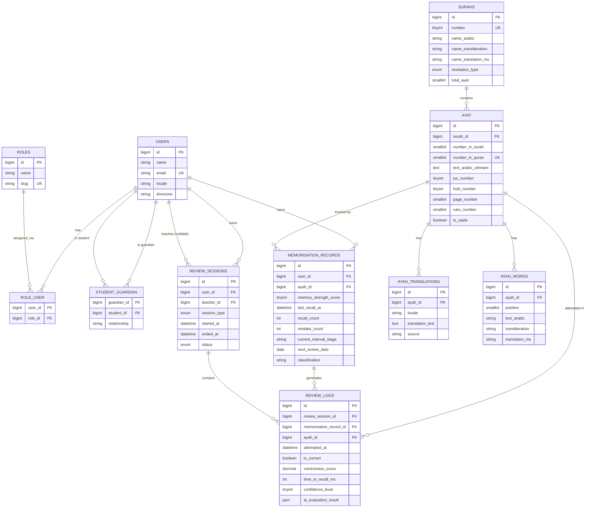

# Phase 3 — Database Design

## 1. ERD

## 2. Table Definitions

See migration source under `database/migrations/` for exact column
types/constraints. Summary:

- **`roles`** / **`role_user`** — many-to-many, so a user can hold multiple
  roles (e.g. teacher + parent) rather than one fixed role column.
- **`student_guardian`** — many-to-many between users, self-referential
  (`guardian_id`/`student_id` both FK to `users`), for parent oversight.
- **`surahs`** — one row per surah (114 total), reference data.
- **`ayat`** — one row per ayah (6,236 total), FK to `surahs`. Table name is
  `ayat` (Arabic plural), not `ayahs` — the `Ayah` Eloquent model explicitly
  sets `protected $table = 'ayat'` to override default pluralisation.
- **`ayah_translations`** — one row per (ayah, locale); `source` records
  provenance (e.g. `alquran.cloud:ms.basmeih`) for attribution.
- **`ayah_words`** — one row per word per ayah, for word-by-word display;
  intentionally unseeded in this scaffold (see `docs/02-system-architecture.md §6`).
- **`memorisation_records`** — the core per-user-per-ayah Adaptive Hifz Engine
  state: memory strength score, recall/mistake counts, current interval
  stage, next review date, Sabak/Sabqi/Manzil classification. Unique on
  `(user_id, ayah_id)`.
- **`review_sessions`** — one row per learning session (Sabak/Sabqi/
  Manzil/mixed), optionally teacher-attributed.
- **`review_logs`** — one row per recitation attempt within a session; the
  `ai_evaluation_result` JSON column stores the raw AI provider response for
  later inspection/tuning without needing a schema change per provider.

## 3. Classification & Interval Reference

`memorisation_records.classification` — `App\Enums\MemorisationClassification`:

| Value | Meaning |
|---|---|
| `sabak` | New memorisation, not yet consolidated |
| `sabqi` | Recent memorisation, active short-interval review |
| `manzil` | Long-term retained, extended-interval review |

`memorisation_records.current_interval_stage` — `App\Enums\ReviewIntervalStage`:

`immediate → 1d → 3d → 7d → 14d → 30d → 60d → 90d → 180d → 365d`

Both are stored as plain `string` columns (not native SQL `ENUM`) and cast to
PHP backed enums on the `MemorisationRecord` model, so adding a new value
later is a code change, not a migration.

The logic that transitions a record between stages/classifications based on
review outcomes lives in `App\Services\SpacedRepetitionScheduler` — memory
decay since the last recall, a gain/penalty formula per attempt, and
promotion/demotion thresholds between Sabak/Sabqi/Manzil. See its class
docblock for the exact formulas and tuning constants.

## 4. Relationships Summary

- `User` 1—* `MemorisationRecord`, `ReviewSession` (as learner), `ReviewSession` (as teacher, nullable)
- `User` *—* `Role` (via `role_user`)
- `User` *—* `User` (via `student_guardian`, self-referential guardian↔student)
- `Surah` 1—* `Ayah`
- `Ayah` 1—* `AyahTranslation`, `AyahWord`, `MemorisationRecord`, `ReviewLog`
- `ReviewSession` 1—* `ReviewLog`
- `MemorisationRecord` 1—* `ReviewLog`

## 5. Indexing Notes

- `memorisation_records`: unique `(user_id, ayah_id)`; composite index
  `(user_id, next_review_date)` for the "what's due today" query the future
  scheduler will run constantly.
- `ayat`: unique `number_in_quran` (1–6236) and unique `(surah_id, number_in_surah)`.
- `review_logs`: index `(memorisation_record_id, attempted_at)` for
  per-ayah history lookups.
- `ayah_translations`: unique `(ayah_id, locale)`.

## 6. Future Extensions

- Gamification tables (achievements, streak snapshots) — not added yet, out
  of scope for this session per the user's explicit scope decision.
- Push notification subscription table — Phase 9.
- Reporting/aggregate tables or materialized views for analytics dashboards
  — Phase 11+, once query patterns are known.
